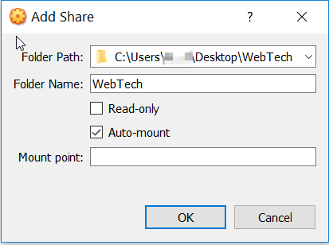

# Lab Assignment #1 - Part I: Development environment setup

**Enter your name here:** [your name]

In this lab assignment you will setup your development environment for the course and become more familiar with fundamental web technologies; namely, the HyperText Transfer Protocol (HTTP). Moreover, you will practice use of some fundamental tools in the course, such as Git and the terminal, in a work environment based on Debian Linux.

**The deliverable for this lab assignment is the current file**, `README.md`, which must be updated with your responses to [Part II](#part2), that is, committed and pushed to your repository. [Part II](#part2) contains four questions for which you must have an operational working environment, based on the course's virtual machine, or which at least contains Git and cURL. 

In case you wonder which language this file is written on, it is [Markdown](https://guides.github.com/features/mastering-markdown/), a simple rich text format that has been almost universally adopted by developers nowadays.

## Pre-requisites

To complete this assignment you must have a user account at GitHub. Create your own account at [GitHub](www.github.com) using your institutional email address (`@miuandes.cl`). Make sure you create an personal access token to use your account effectively. Find indications about this [here](https://docs.github.com/en/authentication/keeping-your-account-and-data-secure/creating-a-personal-access-token).

You will need at least 4 GB of RAM (8 are recommended) and 20 GBs of free disk space (40 GB is recommended) in order to install a virtual machine appliance contaning the necessary software. 

You will need to download:

* VirtualBox: [Download](https://www.virtualbox.org) the latest version available, 6.1.32 at the time of this writing.
* [Download the Virtual Machine Appliance]() (OVA) we will be using in the course.
* Axure RP: We will use this tool for web design. Get it [here](http://axure.com). You may request a free educational license [here](https://www.axure.com/edu). Follow the indications on the page, and fill in the form.
* Git: You may need to install Git on your host operating system (Windows, Mac, Linux) in order to clone this repository and push your responses to it in Part II of this assignment. You may download a Git installer [from here](https://git-scm.com/downloads).
* cURL: If you succeed at installing the course's virtual machine, cURL is included and will be operational for Part II of this assignment. If you fail to install the VM, then you may install cURL manually, by downloading it from its [website](https://curl.se/download.html).

## Virtual Machine Installation

After you download the OVA file (about 4 GBs) contaning the Virtual Machine (VM) with development tools preinstalled, you may add the VM to Virtual Box by importing the `.ova` file.

Follow these steps (instructions apply to the Windows version of VirtualBox, but are similar in Mac or Linux):

* Go to File > Import Appliance (ctr+i). Select the `WebTech-202210.ova` file.


* In the Appliance Settings dialog, set the desired amount of RAM. If your computer has 4 GB, set the virtual machine to use 1.5 GB (if it then runs too slow, increase to 2.0 GB later). If you have 8 GB of RAM or more, increase the RAM available to the VM to 4 GB.

* Optional Step: Configure folder sharing among the host and guest operating systems. This will make folders in your host operating system (e.g. Windows or Mac) available to the guest operating system (i.e., Debian 10 in the VM). This is recommended so you can share files among the operating systems. In VirtualBox's main window, select the VM you installed (i.e WebTech) and then go to Settings (the orange gear) on the toolbar. Then, go to the "Shared Folders" item on the left, and click the little folder with a green plus sign at the right. In the window that appears, select the folder that you would like to share with the guest operating system (e.g. your course folder under "Documents", your Desktop, etc.). Select the "Auto-Mount" option, then OK.




* Finally, run the virtual machine from VirtualBox's main window. You can select the VM on the list, and double click on it, or click on the Start button (green arrow) on the toolbar. Both user and password to log in are 'webtech'.


## Getting started with Ruby Version Manager (RVM), Ruby and Rails

Open LXTerminal available on the Desktop, then enter the following commands

```sh
$ cd Code # Go to the Code directory under the home directory 
$ ls # list the files available
```

The `Code` directory contains a newly created blank Rails application in the `testapp` subdirectory.


* Now, check whether Ruby is available using Ruby Version Manager ([RVM](http://rvm.io)). RVM is a script that can handle installation of several versions of Ruby per user, and can also manage separate sets of Ruby dependencies per Ruby version (modules, aka, gems). In order to list the available versions of Ruby according to RVM, run the following command:

```sh
$ rvm list # Invokes Ruby Version Manager (RVM) to see what versions of Ruby are installed
```

To get started, you may use 3.0:

```sh
$ rvm use 3 # This will set Ruby 3 as the current version.
```

In order to ask RVM what the current version of ruby is, you may enter the following commands:

```sh
$ rvm current
```


When using the Ruby language in your projects, these will usually depend on several libraries (i.e., Ruby gems or modules). In addition, it is common that you need to work on parallel projects. In order to avoid clashes among project dependencies (e.g. one project may depend on Rails version 6, and other on version 7), Ruby Version Manager permits the use of "gemsets", that is, sets of dependencies that can be switched over between projects.

The following command lists the gemsets available to the version of ruby currently used:

```sh
$ rvm gemset list
```

In the image above you will see that a gemset containing Rails 7 for Ruby 3 already exists.

Then you may select the `webtech` gemset as follows:

```sh
$ rvm gemset use webtech
```

You may also enter a command that allows selecting both the version of ruby and gemset at once:

```sh
$ rvm use 3@webtech
```

Now, it is time to create your first Ruby on Rails project. Make sure that the output of the `rvm current` command is as follows:

```sh
$ rvm current
ruby-3.2.0@webtech
```

Also, make sure that the current directory is `~/Code` (i.e., the `~` directory is your home directory):

```sh
$ pwd
/home/webtech/Code
```

Now, create a new Ruby on Rails project:

```sh
$ rails new lab1app # this creates a new rails project in the 'lab1app' folder. 
```

This will take some time as modules need to be installed. If the command succeeds, you will be able to run your first Rails application on the terminal:

```sh
$ cd lab1app
$ bundle install # this will install dependencies for the application
$ rails s # start the application  
```

Now, you may open the Firefox web browser available on the Desktop, and open the following site: `localhost:3000`. See Rails' welcome page display on your browser:


To stop the Rails server, focus the LXTerminal window and press the Control+C key combination. You may now close all applications, and shut down the virtual machine.

## Install Axure RP

We will use Axure RP to design web sites. Our Faculty has licensed this software and you may install it in your own computer.

* Download Axure RP from its [website](https://www.axure.com).
* You will need to get a student license from [here](https://www.axure.com/edu). Your request may take from two to four business days. In the meantime you may use the trial version.

You may now skip to Part II below, unless you would like to install Ruby on your host operating system. If this is the case, read on.

## Ruby toolchain installation alternatives

If you would like to use RVM and Ruby in your host operating system, steps are quite a feat for beginners, so only aim for it _if you know what you are doing_.

### Windows Installation

If you use Windows 10, you will need to join the Windows Insider Program from Microsoft in order to get the latest builds and be able to use an advanced component called Windows Subsystem for Linux (WSL). WSL will allow you to run a Linux distribution, such as Ubuntu, on Windows, through use of the virtualization infrastructure that is readily available on Windows 10 and 11.

The basic steps are to upgrade as follows:

* If you use Windows 10, join the [Windows Insider Program](https://insider.windows.com/en-us/) to get the latest builds.
* Upgrade to a Windows 10 build that supports WSL (build 19041, a.k.a. 20H1, or newer), or use Windows 11.
* Then enable WSL on windwos 10, according to [these instructions](https://docs.microsoft.com/en-us/windows/wsl/install). Or follow this [simple instructions](https://pureinfotech.com/install-wsl-windows-11/) if you use Windows 11.
* The above includes install Ubuntu Linux. After Ubuntu is installed, you will need to install the Ruby toolchain, starting with [RVM](http://rvm.io). Follow installation instructions on the RVM website. After installing RVM, review the [documentation](http://rvm.io/rvm/basics) to get stated.
* It is recommendable to install the latest version of Windows Terminal, available at the Microsoft Store.
* Last but not least, you may choose to use Visual Studio Code (VSCode), RubyMine or other IDE to work on your projects. VSCode is free to install, but RubyMine will require that you obtain a [student license](https://www.jetbrains.com/community/education/) from JetBrains.

### Mac Installation

On a Mac, installation of the Ruby on Rails toolchain can be quite easy, provided that you have a recent version of macOS (Mojave, Catalina, or BigSur).

* The first step is that you [install Homebrew](https://brew.sh) on your Mac. Homebrew is a package manager that permits installing free and open-source software on Macs.
* Install RVM by following the [instructions on the website](http://rvm.io). If any step fails to complete (e.g. installing gpg keys required by RVM), you may resort to Google the error output and will likely find the solution on StackOverflow.
* After installing RVM, review the [documentation](http://rvm.io/rvm/basics) to get stated.
* Last but not least, you may choose to use Visual Studio Code (VSCode), RubyMine or other IDE to work on your projects. VSCode is free to install, but RubyMine will require that you obtain a [student license](https://www.jetbrains.com/community/education/) from JetBrains.

<a name="part2"></a>
# Part II: Basic workings of the HTTP protocol

In this part of the assignment, you will experiment with the HTTP protocol and the use of the cURL command line utility. You may use cURL in the course's VM, or natively in your host operating system.

In the course's VM, or your Mac with Homebrew, or your Windows 10 installation with WSL2, do the following:

1. Open a terminal window (LXTerminal in the VM), and issue the following command:

```sh
$ curl -v www.example.com
```

Now, describe what you see in the command output.

[Write your answer about here]

2. Now, enter the following command:

```sh
$ curl -v http://www.example.com/bogus.html
```

Describe the command output and explain how it differs from the previous command.

[Write your answer about here]

3. Enter the following command:

```sh
$ curl -vi http://stackabuse.com
```

Describe the meaning of the server's response in this case.

[Write your answer about here]

4. Enter the following command:

```sh
$ curl -viL http://stackabuse.com > output.txt
```

This command creates a text file called `output.txt` which you can open with any text editor. Open the file, analyze it, and describe what client-server interactions ocurred in this case, considering the HTTP requests and responses.

[Write your answer about here]

After you respond the questions above, do not forget to commit changes made to this file, and push your repository to GitHub:

```sh
$ git add *
$ git commit -m "My responses to Part II"
$ git push origin main
```
